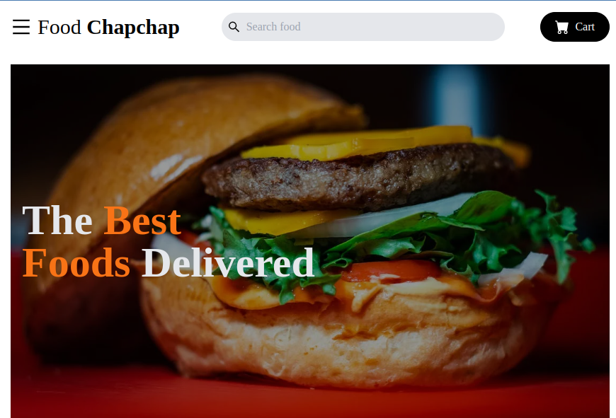

# React + Vite

### Run npm install to install the necessary dependencies

Food Chapchap is a highly responsive User Interface (UI) built using React and styled with Tailwind CSS. The UI simulates an online food ordering system,  offering users the capability to filter food items based on categories and prices. Implemented the mobile-first responsive design approach using flexbox and grid layouts. JSON data was used to populate the UI with data and images, simulating the response from an API for a realistic user experience.

- [@live preview](https://food-chapchap-two.vercel.app/) 
